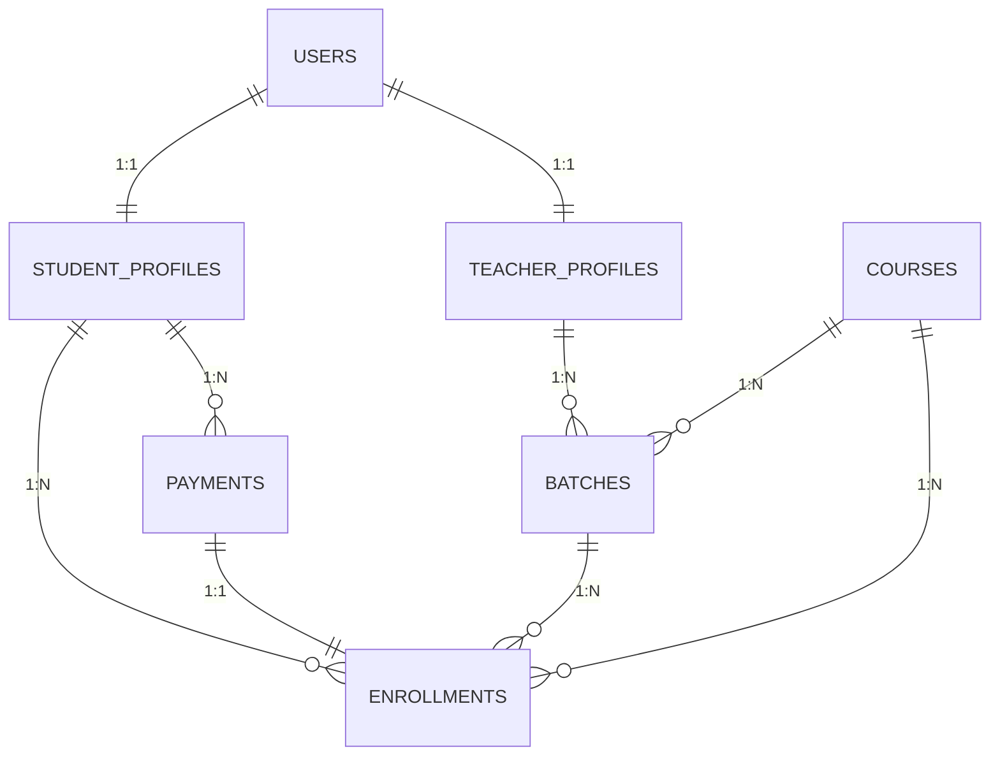

# 📊 Database Design Document (DDD) - Kids AI Coding

**Project:** Kids Coding Academy Platform  
**Version:** 1.0 (Phase 1)  
**Database:** MySQL 8.0+  
**Framework:** CodeIgniter 4.5+

---

## 1. Design Principles
*   **Normalization**: Maintain 3NF (Third Normal Form) where practical to ensure data integrity and reduce redundancy.
*   **Identity Management**: Utilize **CI4 Shield** for core authentication; extend student and teacher data via 1:1 Profile tables.
*   **Data Integrity**: Strict Foreign Keys and composite unique indexes for logical constraints (e.g., preventing double enrollment).
*   **Immutability**: Financial records (Payments/Enrollments) are never hard-deleted to preserve audit trails.
*   **Opaque IDs**: Utilize UUIDs (`CHAR(36)`) for all public-facing identifiers to prevent ID enumeration.

---

## 2. Entity Relationship Diagram (ERD)

---

## 3. Domain Overview

### A. Authentication (Shield)
We use the core tables provided by **CodeIgniter Shield**. We do not modify these directly:
*   `users`: Core account data.
*   `auth_identities`: Passwords and login credentials.
*   `auth_groups_users`: Role assignments (Admin, Teacher, Student).
*   `auth_logins`: Security audit log.

### B. User Profiles
Extended information for specific roles, linked 1:1 with `users.id`.
*   **`students`**: Personal details, age, parent contact info, school details.
*   **`teachers`**: Specialization, bio, profile photo, and rating.

### C. Academic Core
*   **`courses`**: The product catalog. Contains title, slug, price, and difficulty levels.
*   **`batches`**: Specific instances of courses. Links a `course_id` to a `teacher_id` with a schedule and Zoom link.

### D. Transactions & Logic
*   **`enrollments`**: The central junction. Connects a student to a course and/or batch after payment.
*   **`payments`**: The financial log. Stores Razorpay order IDs, status, and amount.

---

## 4. Key Table Specifications

### Table: `enrollments`
| Column | Type | Nullable | Notes |
| :--- | :--- | :--- | :--- |
| `id` | BIGINT (PK) | No | Internal auto-increment ID. |
| `uuid` | CHAR(36) | No | Publicly exposed unique identifier. |
| `student_id` | BIGINT (FK) | No | Student performing the enrollment. |
| `course_id` | BIGINT (FK) | No | The target course. |
| `batch_id` | BIGINT (FK) | Yes | Assigned either at purchase or by admin. |
| `payment_id` | BIGINT (FK) | Yes | Linked payment record. |
| `status` | VARCHAR(30) | No | 'pending', 'active', 'completed', 'cancelled'. |

### Table: `courses`
| Column | Type | Notes |
| :--- | :--- | :--- |
| `id` | BIGINT (PK) | Primary Key. |
| `slug` | VARCHAR(180)| Unique SEO-friendly URL segment. |
| `thumbnail` | VARCHAR(255)| Path to the course image. |
| `price` | DECIMAL(10,2)| Standard price in INR. |
| `is_active` | TINYINT | 1:Visible, 0:Hidden. |

---

## 5. Indexing Strategy
*   **Unique Slugs**: `courses.slug` must be unique for routing.
*   **Profile Link**: `students.user_id` and `teachers.user_id` are unique to ensure 1:1 mapping.
*   **Double Purchase Protection**: Composite unique index on `enrollments(student_id, course_id)` to prevent duplicate active enrollments.
*   **Search Optimization**: Indexes on `status`, `student_id`, and `course_id` for dashboard performance.

---

## 6. Retention & Soft Deletes
*   **Soft Deletes Enabled**: `courses`, `batches`, `students`, `teachers`.
*   **Hard Deletes Prohibited**: `payments`, `enrollments`. These records are permanent for tax and history purposes.

---

## 7. Future Proofing (Phase 2)
The design reserves space for the following without breaking existing relations:
*   `attendance`: Linked to `student_id` and `batch_id`.
*   `assignments`: Linked to `batch_id`.
*   `certificates`: Linked to `enrollment_id`.