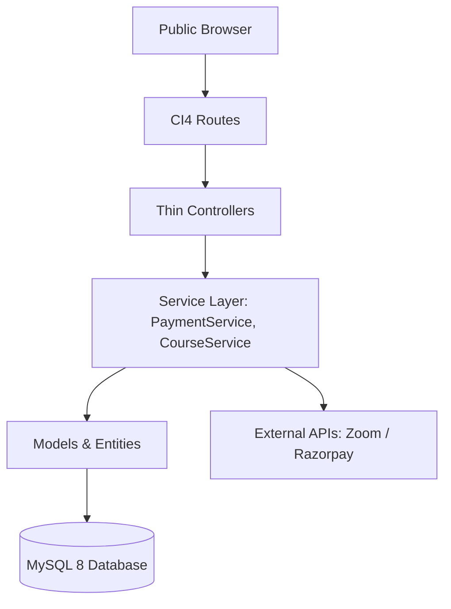

# 🚀 Kids AI Coding Platform (Open Source EdTech)

> **Free, Open-Source Coding & AI Education Platform for Kids Aged 7-18**  
> Empowering students, parents, teachers, and academies with live interactive Zoom classes, project-based curriculum, and role-based learning portals.

[](https://opensource.org/licenses/MIT)
[](https://codeigniter.com)
[](https://php.net)
[](#-open-source--paid-services-model)

---

## 🌟 Key Features

- 🎓 **Interactive Course Catalog:** Scratch, Python, Web Development, Game Design, and AI/Machine Learning tracks.
- 👨‍🏫 **Teacher & Batch Management:** Live Zoom scheduling, student attendance logs, and assignment reviews.
- 📊 **Parent Monitoring Portal:** Real-time attendance summary, child progress tracking, and teacher feedback.
- 🏆 **Student Achievement Engine:** Live class countdown, project submission center, and automated certificate generation.
- 💳 **Payment & Split Settlement Engine:** Built-in Razorpay integration with managed fee split calculations.
- 🛠️ **Admin Management Cockpit:** Complete RBAC, user management, course management, lead management, and revenue analytics.

---

## 💼 Open Source + Paid Services Model

| Feature / Service | Status | Description |
| :--- | :--- | :--- |
| **Core LMS Platform** | 🆓 **100% Free** | Full source code, role portals, courses, and Zoom scheduling. |
| **[Enterprise Consultation](https://kidsaicoding.com/consultation)** | 💼 **Paid Service** | White-labeling, custom domain deployment, custom server setups. |
| **[Teacher Training Certification](https://kidsaicoding.com/training)** | 🎓 **Paid Service** | Certified instructor workshops, STEM teaching methods, and curriculum kits. |
| **Platform Settlements** | 💳 **Managed** | Integrated payment split settlements for academy course sales. |

---

## 🏗️ Architecture & Stack



- **Backend:** CodeIgniter 4.5+ (PHP 8.2+)
- **Database:** MySQL 8.0+
- **Frontend:** Bootstrap 5, Custom CSS Tokens (Vibrant Orange `#F97316`, Clear Blue `#0EA5E9`, Light Canvas `#F8FAFC`)

---

## 🚀 Quickstart Guide

1. **Clone the repository:**
   ```bash
   git clone https://github.com/Sukhman369/kidsaicoding.com.git
   cd kidsaicoding.com
   ```

2. **Install composer dependencies:**
   ```bash
   composer install
   ```

3. **Configure environment:**
   ```bash
   cp env .env
   ```
   Set up your MySQL database credentials in `.env`.

4. **Run database migrations:**
   ```bash
   php spark migrate
   ```

5. **Start development server:**
   ```bash
   php spark serve
   ```
   Visit `http://localhost:8080` in your web browser.

---

## 📖 Documentation

For detailed specifications and domain design, check the `/docs` directory:
- [`PRD.md`](docs/PRD.md) - Product Requirements & Design Tokens
- [`TRD.md`](docs/TRD.md) - Technical Architecture & Coding Guidelines
- [`DDD.md`](docs/DDD.md) - Database Schema & ER Diagram
- [`frontend_requirements.md`](docs/frontend_requirements.md) - Page Specs & Wireframe Descriptions
- [`CONTRIBUTING.md`](CONTRIBUTING.md) - Community Developer Guidelines

---

## 🤝 Contributing

We welcome community contributions! Please read our [`CONTRIBUTING.md`](CONTRIBUTING.md) to get started.

---

## 📄 License

This project is open-source under the [MIT License](LICENSE).