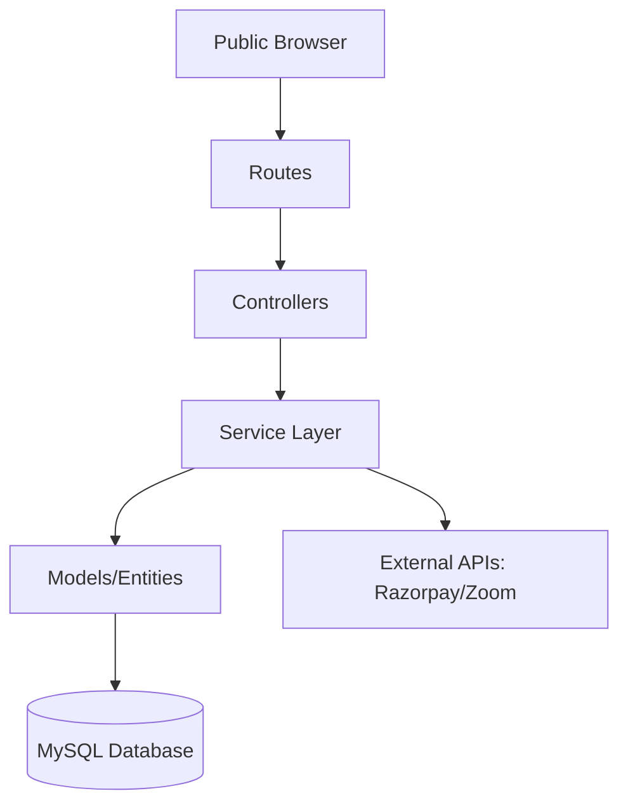

# 🛠️ Technical Requirements Document (TRD) - Kids AI Coding

**Project:** Kids Coding Academy Platform  
**Version:** 1.0 (Phase 1)  
**Framework:** CodeIgniter 4.5+  
**Database:** MySQL 8.0 (Shared Hosting Optimized)  
**Hosting:** Hostinger Shared Hosting

---

## 1. Technical Objectives & Principles
*   **Modular Architecture**: Isolated Services and Entities for long-term scalability.
*   **Shared Hosting Compatibility**: Optimized for low resource usage and efficient execution on shared environments.
*   **AI-First Design**: Explicitly structured to be easily maintained by AI-Assisted development agents.
*   **MVC + Service Layer**: Strict separation where business logic lives exclusively in `app/Services/`.

## 2. Technology Stack
### Backend
*   **PHP 8.3+**: Utilizing the latest performance and type-safety features.
*   **CodeIgniter 4**: High-performance PHP framework with a small footprint.
*   **CI Shield**: Official authentication and authorization library.

### Database
*   **MySQL 8+**: (utf8mb4_unicode_ci collation).
*   **Migration-Driven**: All schema changes must be managed via CI4 Migrations.

### Frontend
*   **Bootstrap 5**: Responsive layout and utility-first styling.
*   **Vanilla JS / jQuery**: For AJAX and interactive UI elements.
*   **Externalized CSS**: No internal `<style>` tags; customized via `css/style.css`.

---

## 3. High-Level Architecture


### Layer Responsibilities:
| Layer | Responsibility | Never Do |
| :--- | :--- | :--- |
| **Controllers** | Request validation, calling services, returning views. | Write SQL or Business Logic. |
| **Services** | Business rules, calculations, external integrations. | Access Global Request/Session directly. |
| **Models** | Pure Database CRUD. | Contain Business Rules. |
| **Entities** | Object representation of DB rows with helper methods. | Call persistence/database methods. |

---

## 4. Project Structure (CI4 Standard + Services)
```text
app/
├── Config/              # App, Database, and Shield configurations
├── Controllers/         # Thin Controllers grouped by role (Admin, Student, etc.)
├── Services/            # THE BRAIN: CourseService, PaymentService, etc.
├── Models/              # Pure CRUD Database access
├── Entities/            # Data objects mapping to DB records
├── Filters/             # RBAC and Auth protection
├── Database/
│   ├── Migrations/      # Version control for DB schema
│   └── Seeds/           # Idempotent demo data
├── Views/               # Shared and role-specific UI templates
└── Libraries/           # Custom wrappers for 3rd party APIs
```

---

## 5. Security & Deployment (Shared Hosting Focus)

### Security Baseline:
*   **CSRF & XSS**: Enabled globally via Config.
*   **Auth**: Role-based access control (RBAC) via Shield.
*   **Environment**: Secrets stored in `.env` (never committed to Git).
*   **Sessions**: Database-backed sessions to avoid file-locking on shared hosts.

### Shared Hosting Bridge:
*   Maintain `public/` as the web root.
*   Use `index.php` routing to ensure security.
*   Optimize queries to avoid high CPU spikes on shared resources.

---

## 6. URL & Naming Standards
*   **REST-like URLs**: `/admin/courses`, `/student/dashboard`, `/course/{slug}`.
*   **Database Tables**: Plural (e.g., `courses`, `enrollments`).
*   **Foreign Keys**: Follow `{singular_table}_id` (e.g., `student_id`).
*   **Timestamps**: Always include `created_at`, `updated_at`, and `deleted_at` (for soft deletes).

---

## 7. Development Order (Sprint-Based)
1.  **Sprint 1**: Project Setup, .env Config, and CI Shield Integration.
2.  **Sprint 2**: Admin Layout & Basic RBAC.
3.  **Sprint 3**: Course & Batch Management.
4.  **Sprint 4**: Student & Teacher Profiles.
5.  **Sprint 5**: Enrollment Workflow & Razorpay Integration.
6.  **Sprint 6**: Student/Parent/Teacher Dashboards.
7.  **Sprint 7**: CMS for Website & SEO Optimization.

---

## 8. AI Development Rules (Critical)
*   **Thin Controllers**: Business logic belongs in Services.
*   **No Schema Hardcoding**: Always generate migrations for DB changes.
*   **Idempotency**: Seeders must be runnable multiple times safely.
*   **DRY (Don't Repeat Yourself)**: Reuse existing service methods.
*   **Scope Isolation**: Never modify unrelated files unless requested.

---

## 9. Architectural Recommendations
1.  **UUIDs for URLs**: Use Opaque IDs/UUIDs for public-facing URLs to prevent enumeration.
2.  **Service Response Protocol**: All Service methods should return a standardized result array (e.g., `['status' => true, 'data' => ...]`).
3.  **Active Flags**: Use `is_active` status for courses/teachers instead of hard deletion.
4.  **Phase 2 Ready**: Design FKs (Foreign Keys) anticipating attendance, certificates, and assignments.